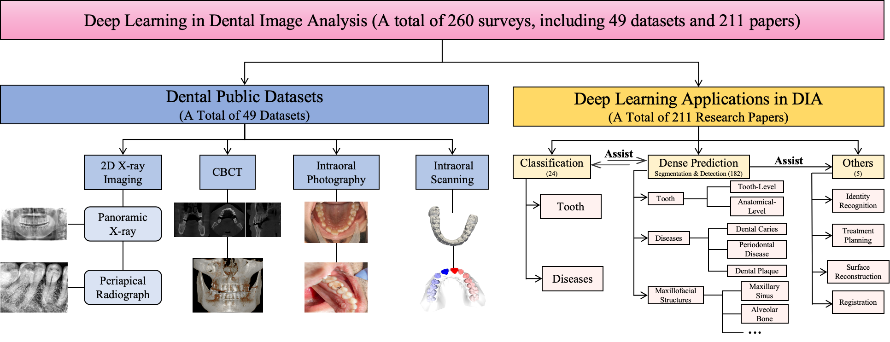
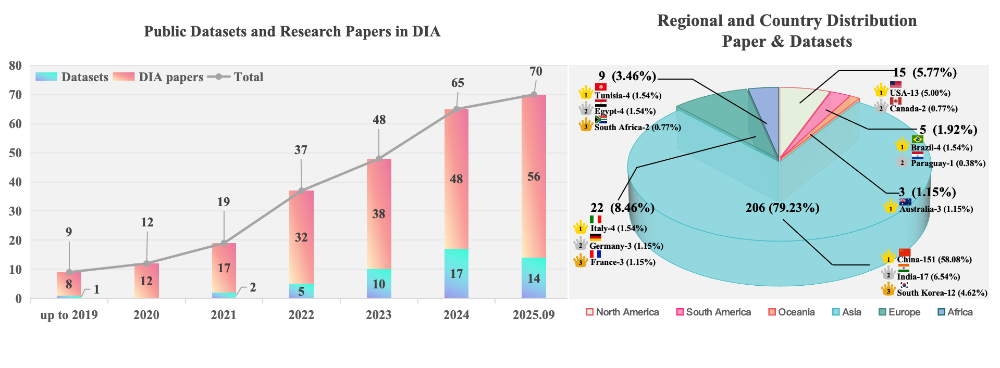
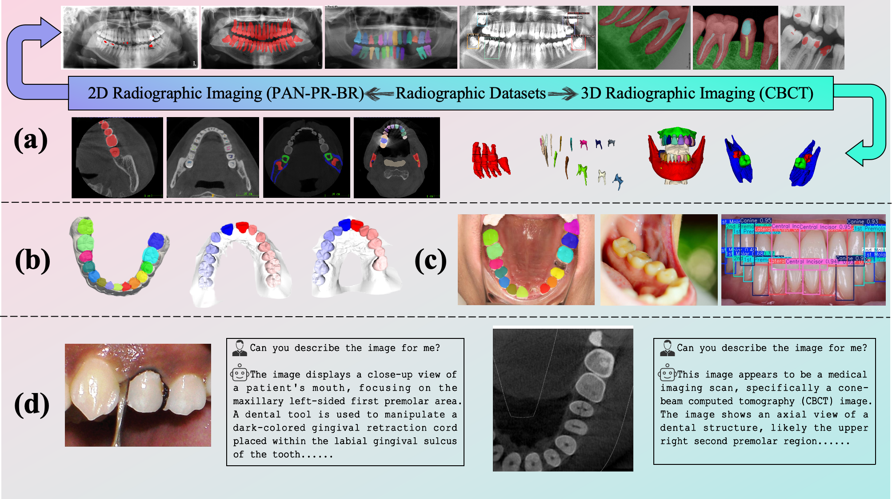
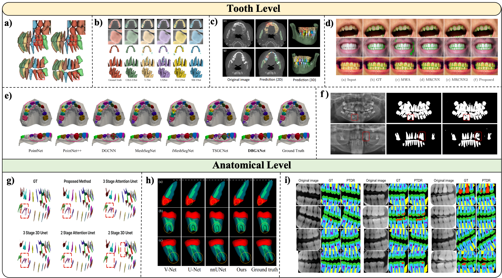
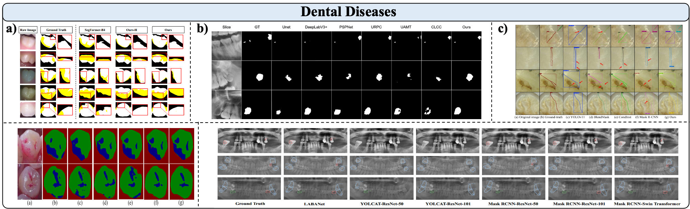
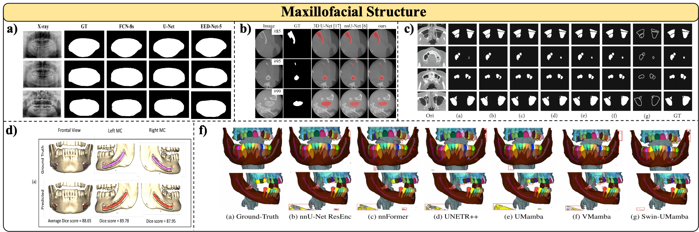
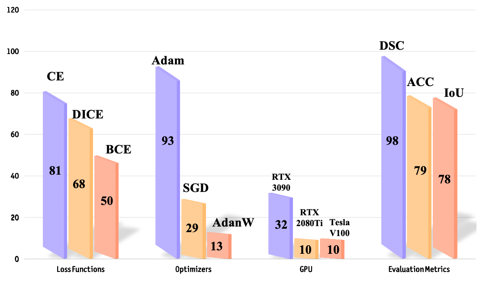
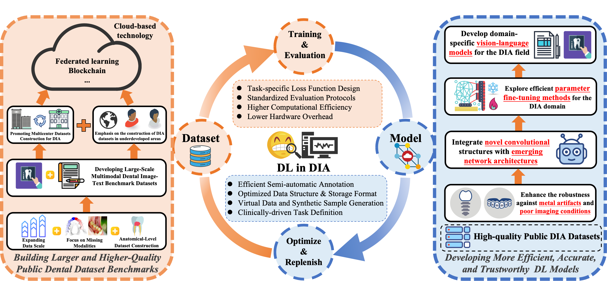

# Deep Learning in Dental Image Analysis: A Systematic Review of Datasets, Methodologies, and Emerging Challenges

[](https://www.sciopen.com/article/10.26599/AIR.2026.9150006)
[](https://awesome.re)
[](https://opensource.org/licenses/MIT)
[]()

This is the official repository for the paper **"Deep Learning in Dental Image Analysis: A Systematic Review of Datasets, Methodologies, and Emerging Challenges"** published in *CAAI Artificial Intelligence Research*.

> 💡 **Abstract:** Efficient analysis and processing of dental images are crucial for computer-aided diagnosis and treatment planning. This systematic review covers **260 studies** (including **49 public datasets** and **211 DL algorithm papers**) published between 2019 and September 2025. We provide a holistic overview from imaging modalities, open-source benchmarks, DL architectures (CNN, ViT, Hybrid), training protocols, to emerging clinical challenges (e.g., metal artifact mitigation, light-weight deployment, XAI, and Dental VLMs).

---

## 📌 Table of Contents
- [News & Updates](#-news--updates)
- [Overview & Taxonomy](#-overview--taxonomy)
- [Public Datasets Benchmark (49 Datasets)](#-public-datasets-benchmark-49-datasets)
- [Methodologies & Categorization (211 Papers)](#-methodologies--categorization-211-papers)
- [Training & Evaluation Statistics](#-training--evaluation-statistics)
- [Future Directions & Challenges](#-future-directions--challenges)
- [Citation](#-citation)

---

## 📢 News & Updates
- **[2026-01]** 📄 Our review paper has been accepted for publication in *CAAI Artificial Intelligence Research*!
- **[2025-09]** 🚀 Repository created with comprehensive metadata for 49 public datasets and 211 DL algorithm papers.

---

## 🌐 Interactive Online Database (WPS Sheet)

To facilitate convenient searching, filtering, and cross-referencing for researchers, we provide a fully annotated, interactive online spreadsheet containing granular metadata for all reviewed studies and datasets:

👉 **[Click Here to Open the Interactive Online Database (WPS Sheet)](【金山文档 | WPS云文档】 综述论文整理
https://www.kdocs.cn/l/cuFF9dDaV80L)**

### 📂 Spreadsheet Structure & Sheet Navigation
- 📄 **`综述论文`**: Exhaustive summary table covering all **211 included deep learning papers**.
- 📊 **`公开数据集论文`**: Comprehensive index of all **49 publicly available dental datasets**.
- ❌ **`淘汰论文`**: Record of filtered-out papers during systematic screening with specific exclusion reasons.
- ❌ **`淘汰数据集`**: Record of filtered-out datasets with specific exclusion reasons.
- 🏷️ **`密集型（分割）` / `分类` / `其他`**: Task-oriented subsets of the 211 studies categorized for targeted retrieval.

---

### 📋 Structured Metadata Schema

#### 1. Research Papers Metadata Schema (211 Studies)
Each paper record is systematically indexed across 5 major technical dimensions:
- **Basic Info (基本情况)**: English Title, Chinese Title, Author Nationality, Publication Venue, Year, Task Type, Main Text Translation Mapping.
- **Data (数据)**: Imaging Modality, Sample Volume, Data Source, Public/Private Status, Data Preprocessing Protocols, Supplementary Figures.
- **Methodology (方法)**: Backbone Architecture, Custom Auxiliary Mechanisms, Detailed Network Model Design, Supplementary Figures.
- **Training Setup (训练)**: Loss Functions & Optimizers, GPU Hardware, Miscellaneous Setup.
- **Experiment & Performance (实验)**: Evaluation Metrics, Testing Protocols, Quantitative Performance Results, Supplementary Figures.

#### 2. Public Datasets Metadata Schema (49 Datasets)
Each public dataset record encompasses complete administrative and technical attributes:
- **General Attributes**: Dataset Name/Alias, English Title, Author Nationality, Publication Venue, Year, Task Type.
- **Data Characteristics**: Imaging Modalities, Target Demographics & Age Groups, Data Volume, Data Source & Descriptions.
- **Access & Availability**: License Types, Acquisition Channels, Availability Status (*Direct Download / Request Required / Inaccessible*), Supplementary Figures.

---

## 🌟 Overview & Taxonomy

<p center="align">
  
</p>

*Figure: Taxonomy of Deep Learning Applications in Dental Image Analysis, categorizing public datasets by modalities (PAN, PR, CBCT, IOS, IP) and deep learning algorithms by task goals and model backbones.*

<details>
<summary><b>🔍 Click to view Annual Publication Trends & Regional Distribution</b></summary>
<br/>
<p center="align">
  
</p>
</details>

---

## 📊 Public Datasets Benchmark (49 Datasets)

We systematically meta-analyze **49 publicly accessible dental datasets** across 5 primary modalities.

<p center="align">
  
  
</p>

### Key Public Datasets Summary (Selection)

| Dataset | Modality | Scale | Task Type | Access |
| :--- | :---: | :---: | :--- | :---: |
| **CTooth / CTooth+** | CBCT | 7,363 / 31,380 | Tooth Semantic Segmentation | Public |
| **ToothFairy / ToothFairy2** | CBCT | 347 / 530 | IAN & Maxillofacial Structure Segmentation | Public |
| **PRAD** | PR | 10,000 | Anatomical-level Tooth Segmentation | On Request |
| **Dentex** | PAN | 3,903 | Lesion Detection & Classification | Public |
| **IO150K** | IOS & IP | 150,000 | Instance Tooth Segmentation | On Request |
| **PubMedVision** | Various | 14,212 (Dental) | Multimodal Image-Text Pretraining | Public |
| **MMDental** | CBCT | 660 cases | Multimodal Image-Text Pretraining | Public |

*(For the complete list and download links for all 49 datasets, please refer to Section 2.2 and Table 2 in our paper.)*

---

## 🧠 Methodologies & Categorization (211 Papers)

The reviewed 211 algorithm papers are categorized into three major streams: **Dense Prediction** (86.26%), **Classification**, and **Derived Tasks** (e.g., Registration, Planning, Surface Reconstruction, Biometrics).

### 1. Tooth-Level & Anatomical-Level Prediction
Focuses on tooth semantic/instance segmentation, FDI numbering, and fine-grained internal tooth structures (dental pulp, dentin, enamel, and root canals).

<p align="center">
  
</p>

### 2. Pathology & Disease Prediction
Detecting and segmenting dental caries, plaque, cracked teeth, periodontitis, and periapical lesions across intraoral photos and radiographs.

<p align="center">
  
</p>

### 3. Maxillofacial Structure Prediction
3D reconstruction and precise boundary delineation for critical jaw structures including Mandible, Maxillary Sinus, Temporomandibular Joint (TMJ), and Inferior Alveolar Nerve (IAN).

<p align="center">
  
</p>

### 4. Classification & Derived Tasks
Covers tooth wear grading, implant classification, multi-modal registration (CBCT-IOS), bracket segmentation, and biometrics.

---

## 🛠️ Training Configurations & Metrics

Statistically aggregated insights on common training setups across 211 DL studies:

<p center="align">
  
</p>

- **Loss Functions**: Cross-Entropy (CE) and Dice Loss dominate segmentation tasks; Smooth L1 Loss is preferred for robust bounding box regression.
- **Optimizers**: **Adam** is by far the most widely adopted optimizer due to adaptive learning rates in complex 3D architectures.
- **Hardware**: **NVIDIA RTX 3090** (24GB) represents the most common training GPU in dental AI labs.

---

## 🚀 Future Directions & Challenges

<p center="align">
  
</p>

- **Architecture-level Metal Artifact Mitigation**: Moving from naive data exclusion to generative prior restoration and uncertainty-aware modeling.
- **Clinical Lightweight & Edge Deployment**: Model pruning, quantization, and knowledge distillation for standard dental workstations.
- **Explainable AI (XAI)**: Transitioning from post-hoc heatmaps (Grad-CAM) to rule-based, clinically interpretable reasoning.
- **Dental Vision-Language Models (Dental VLMs)**: Building large-scale image-report benchmarks for interactive VQA and automated report generation.

---

## 📝 Citation

If you find our paper or dataset survey helpful for your research, please consider citing our work:

```bibtex
@article{Zhou2026, 
author = {Zhenhuan Zhou and Jingbo Zhu and Yuchen Zhang and Xiaohang Guan and Peng Wang and Tao Li},
title = {Deep Learning in Dental Image Analysis: A Systematic Review of Datasets, Methodologies, and Emerging Challenges},
year = {2026},
journal = {CAAI Artificial Intelligence Research},
keywords = {Deep Learning, Dental Image Analysis, Dental Datasets, Systematic Review},
url = {https://www.sciopen.com/article/10.26599/AIR.2026.9150006},
doi = {10.26599/AIR.2026.9150006},
}
